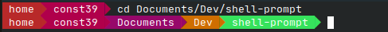

# shell-prompt



Custom Linux shell prompt written in Python.

## Features

-   Display the current working directory
-   Customizable color gradients for text and background
-   Can use TrueColors or 256-Colors for older terminals
-   Other options :
    -   Wrap `/home/<user>` in `~`
-   Configuration set in separate config file

### Upcoming features

-   Customizable prompt size for long paths
-   Customizable directory name length
-   Install using a package instead of Makefile

## Install

**TODO**

## Configure

Customisation is done in a JSON file. By default, the script will look for a file called `settings.json` but you can specify it manually in the command arguments, like that:

```
python3 prompt.py /path/to/settings/file.json
```

### Available settings

-   `background` : An array of hexadecimal color codes. This gradient is used as the background color for each directory "arrow" in the path.
-   `foreground` : An array of hexadecimal color codes. This gradient is used as the text color for each directory in the path.
-   `truecolor` : Sets the color encoding used by the program to indicate the terminal which color to print.
    -   `true` will set the TrueColors encoding, which uses 24 bits to code the color. This is the standard encoding used by modern terminals. It allows a wide range of colors but can be unsupported by old terminals.
    -   `false` will set the 256-Colors encoding, which uses 8 bits to code the color. It allows a narrower range of colors but is supported by nearly every terminal.
-   `wrapHome` : If true, wraps the user directory segment (`/home/<user>`) using a tilde (`~`)

**For color gradient arrays:**
All colors must be hexadecimal color codes. You can put as many colors as you want in the arrays. If the path is longer than the number of colors in the arrays, it will loop back to the first color.

## Disable / Uninstall

**TODO**

## Licence

Licensed under the MIT License.

**Created by const39.**
